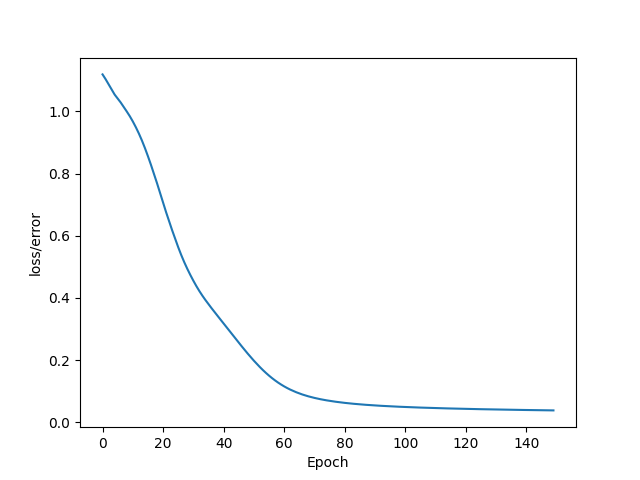

# Iris Dataset PyTorch NN with Flash API

Willkommen zu meinem Projekt! 🎉 In diesem Projekt habe ich ein neuronales Netzwerk mit PyTorch und der Flash API erstellt, um das Iris-Dataset zu klassifizieren. Hier findest du eine detaillierte Erklärung, wie alles funktioniert.

## Inhaltsverzeichnis
1. [Überblick](#überblick)
2. [Installation](#installation)
3. [Datenvorbereitung](#datenvorbereitung)
4. [Modelltraining](#modelltraining)
5. [Ergebnisse](#ergebnisse)
6. [Verwendung](#verwendung)

## Überblick
Dieses Projekt verwendet ein neuronales Netzwerk, um das Iris-Dataset zu klassifizieren. Das Iris-Dataset ist ein klassisches Beispiel in der Datenwissenschaft und enthält Informationen über verschiedene Iris-Blumenarten.

## Installation
Um das Projekt lokal auszuführen, folge diesen Schritten:

1. Klone das Repository:
    ```bash
    git clone https://github.com/L$XB/iris_dataset_pytorch_nn_with_flash_api.git
    ```
2. Wechsle in das Projektverzeichnis:
    ```bash
    cd iris_dataset_pytorch_nn_with_flash_api
    ```
3. Installiere die benötigten Abhängigkeiten:
    ```bash
    pip install -r requirements.txt
    ```

## Datenvorbereitung
Das Iris-Dataset wird automatisch heruntergeladen und vorbereitet. Die Daten werden in Trainings- und Testdatensätze aufgeteilt.

## Modelltraining
Das neuronale Netzwerk wird mit PyTorch und der Flash API trainiert. Hier ist ein Überblick über die Architektur des Modells:

- Eingabeschicht: 4 Neuronen (entsprechend den Merkmalen des Iris-Datasets)
- Verborgene Schicht: 10 Neuronen
- Ausgabeschicht: 3 Neuronen (entsprechend den drei Klassen des Iris-Datasets)

Das Training wird über mehrere Epochen durchgeführt, und der Verlust wird überwacht, um die Leistung des Modells zu bewerten.

## Ergebnisse
Nach dem Training wird die Leistung des Modells anhand des Testdatensatzes bewertet. Hier ist eine Grafik, die den Verlust über die Epochen zeigt:



## Verwendung
Um das trainierte Modell zu verwenden, kannst du das folgende Skript ausführen:

```python
python predict.py --input "5.1,3.5,1.4,0.2"
```

Das Skript gibt die vorhergesagte Klasse der Iris-Blume basierend auf den eingegebenen Merkmalen aus.

## API-Verwendung
Das trainierte Modell kann auch über die Flask API abgefragt werden. Sende eine POST-Anfrage an `localhost:8000/api/classification` mit folgendem Body:

```json
{
    "sepal_length": 7.1,
    "sepal_width": 1.5,
    "petal_length": 4.4,
    "petal_width": 2.1
}
```
Viel Spaß beim Ausprobieren! 🚀